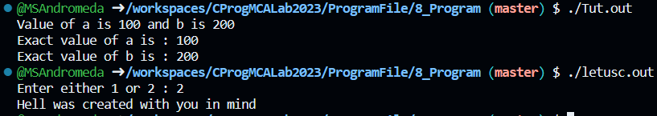

# 💻 Program 10

## Objective
**Write a program to demostrate working of nested if statement in C Programming**

## Theory

### nested if Statement:
You can use one if or else if statement inside another if or else if statement(s).

### nested if Statement Syntax
```
if( boolean_expression 1) {

   /* Executes when the boolean expression 1 is true */
   if(boolean_expression 2) {
      /* Executes when the boolean expression 2 is true */
   }
}
```

## Code
```c
// TutorialsPoint Program
#include <stdio.h>
 
int main () {

   /* local variable definition */
   int a = 100;
   int b = 200;
 
   /* check the boolean condition */
   if( a == 100 ) {
   
      /* if condition is true then check the following */
      if( b == 200 ) {
         /* if condition is true then print the following */
         printf("Value of a is 100 and b is 200\n" );
      }
   }
   
   printf("Exact value of a is : %d\n", a );
   printf("Exact value of b is : %d\n", b );
 
   return 0;
}
// C Programming Book Program

/* A quick demo of nested if-else */ 
#include <stdio.h>
int main( ) 
{ 
    int i ; 
    printf ( "Enter either 1 or 2 " ) ; 
    scanf ( "%d", &i ) ; 
    if ( i == 1 ) 
        printf ( "You would go to heaven !" ) ; 
    else 
    { 
        if ( i == 2 ) 
            printf ( "Hell was created with you in mind" ) ; 
        else 
            printf ( "How about mother earth !" ) ; 
    } 
    return 0;
} 
```

## Output
