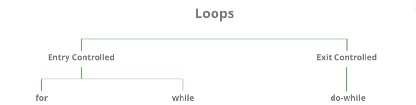

# Program 11
## Objective
**Write a program to demostrate working of while Loop in C Programming**


## Theory

### C - Loops


A loop statement allows us to execute a statement or group of statements multiple times. Given below is the general form of a loop statement in most of the programming languages −


### While Loop:
Repeats a statement or group of statements while a given condition is true. It tests the condition before executing the loop body.

### While Loop Syntax
```
while(condition) {
   statement(s);
}
```

## Code
```c
// TutorialsPoint Program
#include <stdio.h>
 
int main () {

   /* local variable definition */
   int a = 10;

   /* while loop execution */
   while( a < 20 ) {
      printf("value of a: %d\n", a);
      a++;
   }
 
   return 0;
}

// C Programming Book Program
#include<stdio.h>
int main( ) 
{ 
    int p, n, count ; 
    float r, si ; 
    count = 1 ; 
    while ( count <= 3 ) 
    { 
        printf ( "\nEnter values of p, n and r : " ) ;
        scanf("%d %d %f", &p, &n, &r);
        si=p*n*r/100;
        printf ( "Simple interest = Rs. %f\n", si ) ; 
        count++;
    } 
    return 0;
}
```

## Output
