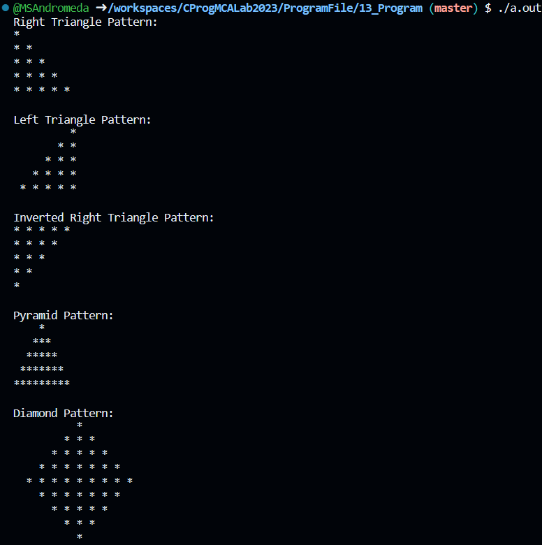

# 💻 Program 14
## Objective
**Write a program to print different patterns using for Loop in C Programming**

## Code
```c
#include <stdio.h>

int main() {
    int n = 5;

    printf("Right Triangle Pattern:\n");
    for (int i = 0; i < n; i++) {
        for (int j = 0; j <= i; j++) {
            printf("* ");
        }
        printf("\n");
    }

    printf("\nLeft Triangle Pattern:\n");
	for (int i = 0; i < n; i++) {
		for (int j = 0; j < 2 * (n - i) - 1; j++) {
			printf(" ");
		}
		for (int k = 0; k <= i; k++) {
			printf("* ");
		}
		printf("\n");
	}

    printf("\nInverted Right Triangle Pattern:\n");
        for (int i = n; i > 0; i--) {
        for (int j = 0; j < i; j++) {
            printf("* ");
        }
        printf("\n");
    }

    printf("\nPyramid Pattern:\n");
        for (int i = 1; i <= n; i++) {
        for (int j = 1; j <= n - i; j++) {
            printf(" ");
        }
        for (int k = 1; k <= 2 * i - 1; k++) {
            printf("*");
        }
        printf("\n");
    }

    printf("\nDiamond Pattern:\n");
        for (int i = 0; i < n; i++) {
        for (int j = 0; j < n - i; j++) {
            printf("  ");
        }
        for (int k = 0; k < 2 * i + 1; k++) {
            printf("* ");
        }
        printf("\n");
    }
    for (int i = n - 2; i >= 0; i--) {
        for (int j = 0; j < n - i; j++) {
            printf("  ");
        }
        for (int k = 0; k < 2 * i + 1; k++) {
            printf("* ");
        }
        printf("\n");
    }

    return 0;
}
```

## Output
