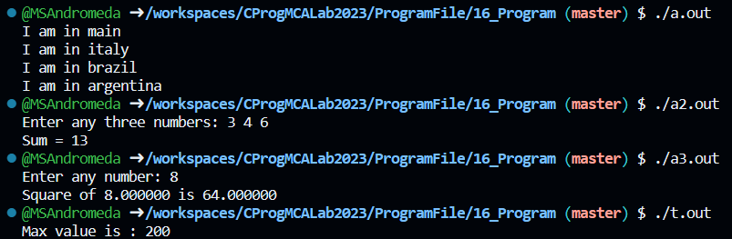

# 💻 Program 16
## Objective
**Write a program to demostrate Working of functions in C Programming**

## Theory

### C - Functions
A function is a group of statements that together perform a task. Every C program has at least one function, which is main(), and all the most trivial programs can define additional functions.

### Syntax of Functions in C
The syntax of function can be divided into 3 aspects:

- Function Declaration
- Function Definition
- Function Calls

#### Function Declaration Syntax
```
return_type function_name( parameter list );
```
- Exapmle: `int sum(int a, int b);`

#### Function Definition Syntax
```
return_type function_name( parameter list ) {
   body of the function
}
```
- Example: `int sum(int a, int b) 
{ 
  return a + b; 
}`

#### Function Call Syntax
```
function_name( parameter list );
```
- Example: `sum(10, 30);`

### Function Arguments
If a function is to use arguments, it must declare variables that accept the values of the arguments. These variables are called the formal parameters of the function.

Formal parameters behave like other local variables inside the function and are created upon entry into the function and destroyed upon exit.

While calling a function, there are two ways in which arguments can be passed to a function −
| Call Type                | Description                                                  |
| :----------------------- | ------------------------------------------------------------ |
|      `Call By Value`     | This method copies the actual value of an argument into the formal parameter of the function.|
|      `Call By Reference` | This method copies the address of an argument into the formal parameter.|

## Code
```c
// Program from Let us C
// First Program
#include <stdio.h>

void italy();
void brazil();
void argentina();

int main( ) 
{ 
    printf("I am in main"); 
    italy(); 
    brazil(); 
    argentina();
    return 0;
}

void italy() 
{ 
 printf ("\nI am in italy"); 
} 
void brazil() 
{ 
 printf ("\nI am in brazil"); 
} 
void argentina() 
{ 
 printf ("\nI am in argentina\n"); 
}

// Second Program
#include <stdio.h>

int calsum();
/* Sending and receiving values between functions */ 
int main( ) 
{ 
    int a, b, c, sum ; 
    printf ( "Enter any three numbers: " ) ; 
    scanf ( "%d %d %d", &a, &b, &c ) ; 
    sum = calsum ( a, b, c ) ;
    printf ( "Sum = %d\n", sum ) ; 
}

int calsum ( x, y, z ) 
int x, y, z ; 
{ 
    int d ; 
    d = x + y + z ; 
    return ( d ) ; 
}

// Third Program
#include <stdio.h>

float square( float x);

int main( ) 
{ 
    float a, b ; 
    printf ( "Enter any number: " ) ; 
    scanf ( "%f", &a ) ; 
    b = square ( a ) ; 
    printf ( "Square of %f is %f\n", a, b ) ; 
}

float square ( float x ) 
{ 
    float y ; 
    y = x * x ; 
    return ( y ) ; 
}

// Program from Tutorials Point
#include <stdio.h>
 
/* function declaration */
int max(int num1, int num2);
 
int main () {

   /* local variable definition */
   int a = 100;
   int b = 200;
   int ret;
 
   /* calling a function to get max value */
   ret = max(a, b);
 
   printf( "Max value is : %d\n", ret );
 
   return 0;
}
 
/* function returning the max between two numbers */
int max(int num1, int num2) {

   /* local variable declaration */
   int result;
 
   if (num1 > num2)
      result = num1;
   else
      result = num2;
 
   return result; 
}
```

## Output
