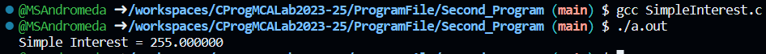

# 💻 Program 2

## Objective

**Write a program to Calculate Simple Interest of A Investment in C Language**

## Theory

### Datatypes in C


#### Primitive Datatypes
- Primitive data types are the most basic data types that are used for representing simple values such as integers, float, characters, etc.

|  Datatype                | Description                                                                                        |
| --------:                | -----------------------------------------------                                                    |
| `Integer`                | Stores whole numbers, including octal and hexadecimal.                                             |
| `Character`              | Holds a single character, requires 1 byte.                                                         |
| `Floating Point`         | Stores decimal and exponential values with single precision.                                       |
| `Double Floating Point`  | Stores decimal numbers with double precision.                                                      |
| `Void`                   | Represents absence of a value; used in various ways, including function return types and pointers. |


## Code

```c
#include<stdio.h>

int main( )
{
    int p, n ;
    float r, si ;

    p = 1000 ;
    n = 3 ;
    r = 8.5 ;

    /* formula for simple interest */
    si = p * n * r / 100 ;
    
    printf ( "Simple Interest = %f\n" , si ) ;
   /* %f for float data type in formatted strings. */

    return 0;
}
```

## Output
