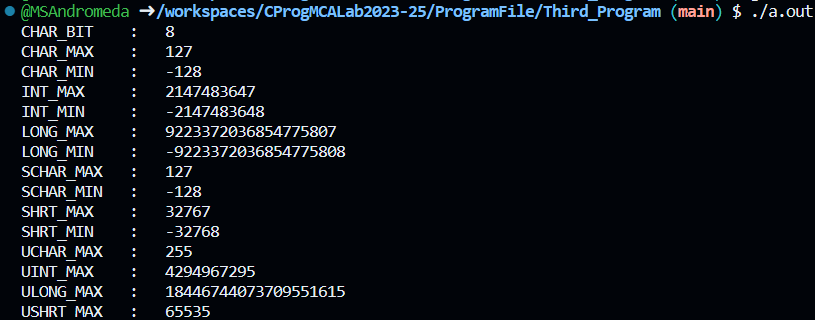

# 💻 Program 3

## Objective

**Write a program to provides the details of standard integer types in C Language**

## Theory

### `#include` Statements

- `#include <stdlib.h>`: This line includes the standard library for functions like memory allocation (`malloc`, `free`).

- `#include <limits.h>`: This line includes a library containing constants for integer data types' limits.

- `#include <float.h>`: This line includes a library containing constants for floating-point data types' limits.


### Integer Types
The following table provides the details of standard integer types with their storage sizes and value ranges −

|Type	|Storage size|	Value range|
|----:|------------|------------|
|`char`	|1 byte	|-128 to 127 or 0 to 255|
|`unsigned char`|	1 byte|	0 to 255|
|`signed char`|	1 byte|	-128 to 127|
|`int`	|2 or 4 bytes	|-32,768 to 32,767 or -2,147,483,648 to 2,147,483,647|
|`unsigned int`|	2 or 4 bytes	|0 to 65,535 or 0 to 4,294,967,295|
|`short`|	2 bytes	|-32,768 to 32,767|
|`unsigned short`|	2 bytes	|0 to 65,535|
|`long`	|8 bytes or (4bytes for 32 bit OS)|	-9223372036854775808 to 9223372036854775807|
|`unsigned long`	|8 bytes	|0 to 18446744073709551615|

## Code

```c
#include <stdio.h>
#include <stdlib.h>
#include <limits.h>
#include <float.h>

int main() {

    printf("CHAR_BIT    :   %d\n", CHAR_BIT);
    // %d for integer data type in formatted strings.
    printf("CHAR_MAX    :   %d\n", CHAR_MAX);
    printf("CHAR_MIN    :   %d\n", CHAR_MIN);
    printf("INT_MAX     :   %d\n", INT_MAX);
    printf("INT_MIN     :   %d\n", INT_MIN);
    printf("LONG_MAX    :   %ld\n", (long) LONG_MAX);
    // %ld for long integer data type in formatted strings.
    printf("LONG_MIN    :   %ld\n", (long) LONG_MIN);
    printf("SCHAR_MAX   :   %d\n", SCHAR_MAX);
    printf("SCHAR_MIN   :   %d\n", SCHAR_MIN);
    printf("SHRT_MAX    :   %d\n", SHRT_MAX);
    printf("SHRT_MIN    :   %d\n", SHRT_MIN);
    printf("UCHAR_MAX   :   %d\n", UCHAR_MAX);
    printf("UINT_MAX    :   %u\n", (unsigned int) UINT_MAX);
    // %u for unsigned integer data type in formatted strings.
    printf("ULONG_MAX   :   %lu\n", (unsigned long) ULONG_MAX);
    // %lu for unsigned long integer data type in formatted strings.
    printf("USHRT_MAX   :   %d\n", (unsigned short) USHRT_MAX);

    return 0;
}
```


## Output
