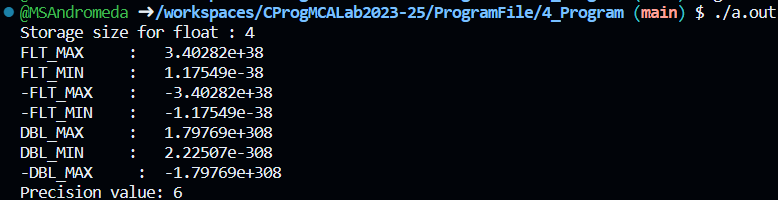

# 💻 Program 4

## Objective

**Write a program to provides the details of standard floating-point types in C Language**

## Theory

### Floating-Point Types
The following table provide the details of standard floating-point types -
|   Type       | Storage size |       Value range         | Precision         |
| :----------- | :----------: | :-----------------------: | :----------------: |
| float        |    4 bytes   | 1.2E-38 to 3.4E+38       | 6 decimal places   |
| double       |    8 bytes   | 2.3E-308 to 1.7E+308     | 15 decimal places  |
| long double  |   10 bytes   | 3.4E-4932 to 1.1E+4932   | 19 decimal places  |


## Code

```c
#include <stdio.h>
#include <stdlib.h>
#include <limits.h>
#include <float.h>

int main() {

    printf("Storage size for float : %lu \n", sizeof(float));
    // sizeof(Data_Type): Calculates the storage space in bytes of the provided data type.

    printf("FLT_MAX: %g\n", (float) FLT_MAX);
    // %g: Format specifier for a general floating-point number.
    printf("FLT_MIN: %g\n", (float) FLT_MIN);
    printf("-FLT_MAX: %g\n", (float) -FLT_MAX);
    printf("-FLT_MIN: %g\n", (float) -FLT_MIN);
    printf("Double Max: %g\n", (double) DBL_MAX);
    printf("Double Min: %g\n", (double) DBL_MIN);
    printf("-Double Max: %g\n", (double) -DBL_MAX);

    printf("Float Precision: %d decimal places\n", FLT_DIG);
    // Decimal digits of precision for float.

    return 0;
}
```

## Output
