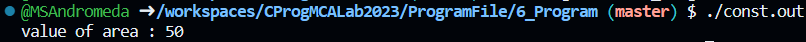

# 💻 Program 6

## Objective
**Write a Program expalaining the working of Constants in C Language**

## Theory

### Constants
Constants refer to fixed values that the program may not alter during its execution. These fixed values are also called literals.

Constants can be of any of the basic data types like an integer constant, a floating constant, a character constant, or a string literal. There are enumeration constants as well.

#### Integer Literals
An integer literal can be a decimal, octal, or hexadecimal constant. 

Following are other examples of various types of integer literals −
```
85         /* decimal */
0213       /* octal */
0x4b       /* hexadecimal */
```

#### Floating-point Literals
A floating-point literal has an integer part, a decimal point, a fractional part, and an exponent part. You can represent floating point literals either in decimal form or exponential form.

Here are some examples of floating-point literals −

```
3.14159       /* Legal */
314159E-5L    /* Legal */
```

#### Character Constants Literals
Character literals are enclosed in single quotes, e.g., 'x' can be stored in a simple variable of char type.

A character literal can be a plain character (e.g., 'x'), an escape sequence (e.g., '\t'), or a universal character (e.g., '\u02C0').

#### Sting Literals
String literals or constants are enclosed in double quotes "". A string contains characters that are similar to character literals: plain characters, escape sequences, and universal characters.

Here is a example of string literals. The two forms are identical strings.
```
"hello, dear"

"hello, " "d" "ear"
```

### Defining Constants
There are two simple ways in C to define constants −
- Using `#define` preprocessor.
- Using `const` keyword.

#### The #define Preprocessor
Given below is the form to use #define preprocessor to define a constant −
```
#define identifier value
```

#### The const Keyword
You can use const prefix to declare constants with a specific type as follows −
```
const type variable = value;
```


## Code

```c
#include <stdio.h>

#define NEWLINE '\n'

int main() {
   const int  LENGTH = 10;
   const int  WIDTH = 5;
   int area;  
   
   area = LENGTH * WIDTH;
   printf("value of area : %d", area);
   printf("%c", NEWLINE);

   return 0;
}
```

## Output


