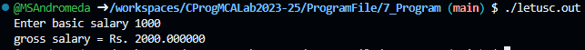

# Program 7
## Objective
**Understanding Decision Making Statement if-else**


## Software Requirements
**`Windows 11, Github Codespaces, Chrome(or other browser for using CodeSpaces)`**


## Theory

### if-else Statement Syntax
```
if(boolean_expression) {
   /* statement(s) will execute if the boolean expression is true */
} else {
   /* statement(s) will execute if the boolean expression is false */
}
```

### if-else Statement:
An if statement can be followed by an optional else statement, which executes when the Boolean expression is false.


## Code
```c
// TutorialsPoint Program
#include <stdio.h>
 
int main () {

   /* local variable definition */
   int a = 100;
 
   /* check the boolean condition */
   if( a < 20 ) {
      /* if condition is true then print the following */
      printf("a is less than 20\n" );
   } else {
      /* if condition is false then print the following */
      printf("a is not less than 20\n" );
   }
   
   printf("value of a is : %d\n", a);
 
   return 0;
}

// C Programming Book Program

/* Calculation of gross salary */ 
#include <stdio.h>
int main() 
{ 
    float bs, gs, da, hra ; 
    printf ( "Enter basic salary " ) ; 
    scanf ( "%f", &bs ) ; 

    if ( bs < 1500 )
    { 
        hra = bs * 10 / 100 ; 
        da = bs * 90 / 100 ; 
    } 
    else 
    { 
        hra = 500 ; 
        da = bs * 98 / 100 ; 
    } 
    gs = bs + hra + da ; 
    printf ( "gross salary = Rs. %f", gs ) ; 
} 

```

## Output

