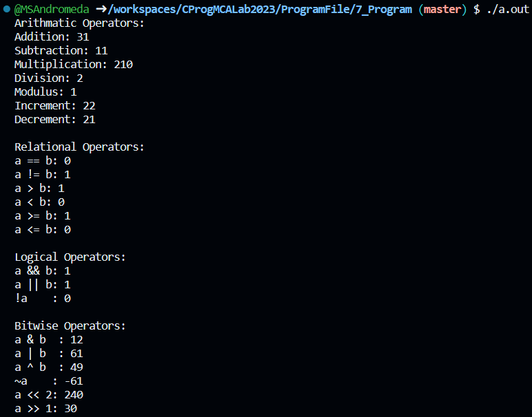
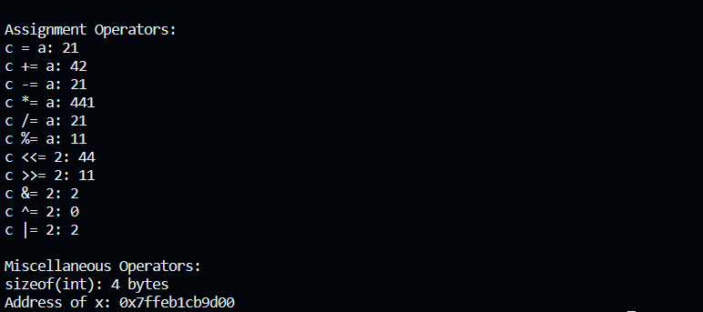

# 💻 Program 7

## Objective

**Write a program to demostrate working of different Operators in C Language**

## Theory

### C-Operators
An operator is a symbol that tells the compiler to perform specific mathematical or logical functions. C language provides the following types of operators −
- Arithmetic Operators
- Relational Operators
- Logical Operators
- Bitwise Operators
- Assignment Operators
- Misc Operators

#### Arithmatic Operators
The following table shows all the arithmetic operators supported by the C language. Assume variable A holds 10 and variable B holds 20 then −

| Operator | Description                                                  | Example     |
| -------: | ------------------------------------------------------------ | ----------- |
|      `+` | Adds two operands.                                           | A + B = 30  |
|      `-` | Subtracts second operand from the first.                     | A − B = -10 |
|      `*` | Multiplies both operands.                                    | A * B = 200 |
|      `/` | Divides numerator by de-numerator.                           | B / A = 2   |
|      `%` | Gives remainder after an integer division.                   | B % A = 0   |
|      `++`| Increases the integer value by one.                          | A++ = 11    |
|      `--`| Decreases the integer value by one.                          | A++ = 11    |

#### Relational Operators
The following table shows all the relational operators supported by C. Assume variable A holds 10 and variable B holds 20 then −

| Operator | Description               | Example    |
| -------: | ------------------------- | ---------- |
|     `==` | Equal to                  | (A == B) is not true. |
|     `!=` | Not Equal to              | (A != B) is true. |
|      `>` | Greater than              | (A > B) is not true. |
|      `<` | Less than                 | (A < B) is true.   |
|     `>=` | Greater than equal to     | (A >= B) is not true. |
|      `<=`| Less than equal to        | (A <= B) is true. |

#### Logical Operators
The following table shows all the arithmetic operators supported by the C language. Assume variable A holds 10 and variable B holds 20 then −

| Operator | Description                                  | Example            |
| -------: | -------------------------------------------- | ------------------ |
|    `&&`  | Logical AND: True only if both non-zero     | (A && B) is false. |
|   `\|\|` | Logical OR: True if either non-zero          | (A \|\| B) is true. |
|     `!`  | Logical NOT: Reverses operand's logic state  | !(A && B) is true. |


#### Bitwise Operators
Bitwise operator works on bits and perform bit-by-bit operation. The truth tables for &, |, and ^ is as follows −
|  p  |  q  |p & q| p \| q | p ^ q  |
| :-: | :-: | :-: | :----: | :----: |
| 0   |  0  |  0  |    0   |    0   |
| 0   |  1  |  0  |    1   |    1   |
| 1   |  1  |  1  |    1   |    0   |
| 1   |  0  |  0  |    1   |    1   |

The following table lists the bitwise operators supported by C. Assume variable 'A' holds 60 and variable 'B' holds 13, then −

| Operator | Description                                      | Example         |
| -------: | ----------------------------------------------- | --------------- |
|      `&` | Binary AND: Returns 1 if both bits are 1        | (A & B) = 12    |
|     `\|` | Binary OR: Returns 1 if any bit is 1            | (A \| B) = 61   |
|      `^` | Binary XOR: Copies if set in one but not both  | (A ^ B) = 49    |
|      `~` | Unary One's Complement: Flips bits              | (~A) = -60      |
|     `<<` | Left Shift: Shifts left by right operand bits   | A << 2 = 240    |
|     `>>` | Right Shift: Shifts right by right operand bits | A >> 2 = 15     |


#### Assignment Operators

| Operator | Description                                         | Example                                  |
| -------: | --------------------------------------------------- | ---------------------------------------- |
|      `=` | Simple assignment: Assigns right to left operand    | C = A + B assigns A + B to C             |
|     `+=` | Add AND assignment: Adds right to left and assigns  | C += A is like C = C + A                 |
|     `-=` | Subtract AND assignment: Subtracts and assigns      | C -= A is like C = C - A                 |
|     `*=` | Multiply AND assignment: Multiplies and assigns     | C *= A is like C = C * A                 |
|     `/=` | Divide AND assignment: Divides and assigns          | C /= A is like C = C / A                 |
|     `%=` | Modulus AND assignment: Takes modulus and assigns   | C %= A is like C = C % A                 |
|    `<<=` | Left shift AND assignment: Left shift and assigns   | C <<= 2 is like C = C << 2               |
|    `>>=` | Right shift AND assignment: Right shift and assigns | C >>= 2 is like C = C >> 2               |
|     `&=` | Bitwise AND assignment: Bitwise AND and assigns     | C &= 2 is like C = C & 2                 |
|     `^=` | Bitwise XOR assignment: Bitwise XOR and assigns     | C ^= 2 is like C = C ^ 2                 |
|    `\|=` | Bitwise OR assignment: Bitwise OR and assigns       | C \|= 2 is like C = C \| 2               |


#### Misc Operators ↦ sizeof & ternary
Besides the operators discussed above, there are a few other important operators including sizeof and ? : supported by the C Language.

| Operator   | Description                                   | Example                                               |
| ---------: | --------------------------------------------- | ----------------------------------------------------- |
| `sizeof()` | Returns size of variable                      | `sizeof(a)` for `a` as integer returns 4              |
|      `&`   | Returns address of variable                   | `&a` returns the actual address of the variable       |
|      `*`   | Pointer to variable                           | `*a` returns the value at the address stored in `a`   |
|      `?:`  | Conditional (Ternary) Operator                | `Condition ? X : Y` returns `X` if true, `Y` otherwise|

## Code

```c
#include <stdio.h>

int main() {

    unsigned int a = 21;
    unsigned int b = 10;
    int c;
   
    printf("Arithmatic Operators:\n");
    printf("a + b: %d\n", a + b );	
    printf("a - b: %d\n", a - b );
    printf("a * b: %d\n", a * b );
    printf("a / b: %d\n", a / b );
    printf("a % b: %d\n", a % b );
    printf("++a: %d\n", ++a );
    printf("--a: %d\n", --a );


    printf("\nRelational Operators:\n");
    printf("a == b: %d\n", a == b); // 0 (false)
    printf("a != b: %d\n", a != b); // 1 (true)
    printf("a > b: %d\n", a > b);   // 0 (false)
    printf("a < b: %d\n", a < b);   // 1 (true)
    printf("a >= b: %d\n", a >= b); // 0 (false)
    printf("a <= b: %d\n", a <= b); // 1 (true)
   

    printf("\nLogical Operators:\n");
    printf("a && b: %d\n", a && b);
    printf("a || b: %d\n", a || b);
    printf("!a    : %d\n", !a);


    a = 60;
    b = 13;

    printf("\nBitwise Operators:\n");
    printf("a & b  : %d\n", a & b);
    printf("a | b  : %d\n", a | b);
    printf("a ^ b  : %d\n", a ^ b);
    printf("~a    : %d\n", ~a);
    printf("a << 2: %d\n", a << 2);
    printf("a >> 1: %d\n", a >> 1);


    a = 21;

    printf("\nAssignment Operators:\n");
    c = a;
    printf("c = a: %d\n", c);
    c += a;
    printf("c += a: %d\n", c);
    c -= a;
    printf("c -= a: %d\n", c);
    c *= a;
    printf("c *= a: %d\n", c);
    c /= a;
    printf("c /= a: %d\n", c);
    c = 200;
    c %= a;
    printf("c %%= a: %d\n", c);
    c <<=  2;
    printf("c <<= 2: %d\n", c );
    c >>=  2;
    printf("c >>= 2: %d\n", c );
    c &=  2;
    printf("c &= 2: %d\n", c );
    c ^=  2;
    printf("c ^= 2: %d\n", c );
    c |=  2;
    printf("c |= 2: %d\n", c );


    printf("\nMiscellaneous Operators:\n");
    printf("sizeof(int): %lu bytes\n", sizeof(int)); // Sizeof operator
    int x = 42;
    int *ptr = &x; // Address-of operator
    printf("Address of x: %p\n", ptr);

    return 0;
}
```

## Output



