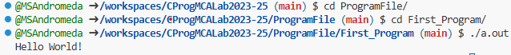
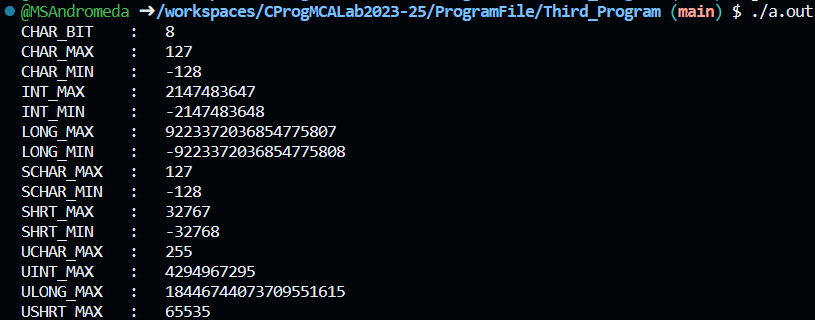
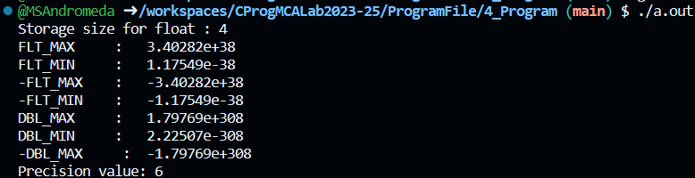
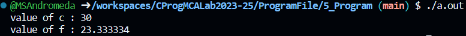
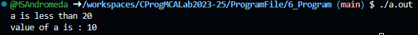
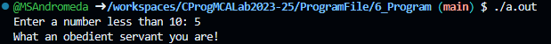
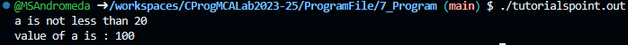
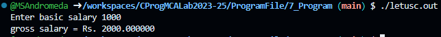
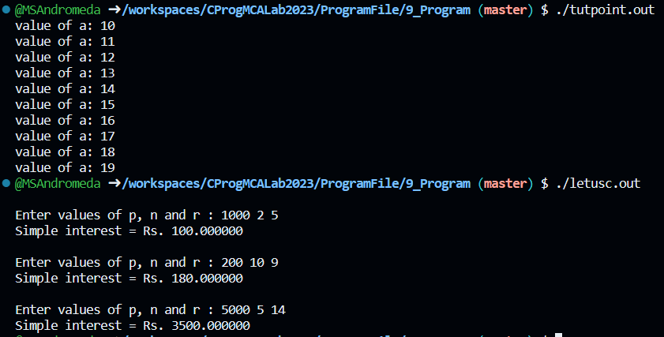
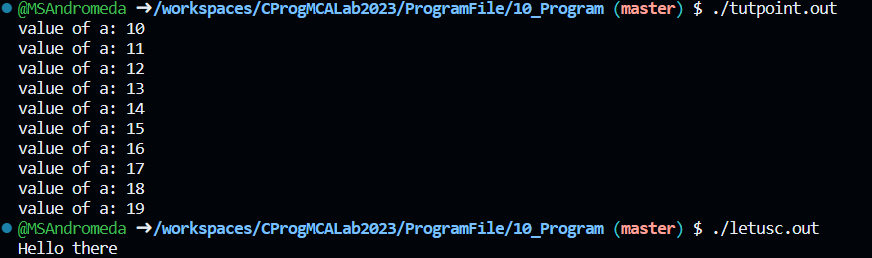

# Hello Everyone! 👋

<blockquote>
I'm Manas Anand Singh, and I'm thrilled to introduce this repository to make C Programming a breeze for everyone. If you find value in my work, please consider following me on <a href="https://github.com/MSAndromeda">github</a>. Your support means the world to me, and it keeps me motivated to continue providing helpful content.

🚀 Let's code together and learn!

**Thank you for your support!**

Warm regards,
Manas Anand Singh (Andro) 😊

<a href="https://github.com/MSAndromeda" style="background-color:#0366d6; color:#ffffff; padding: 10px 20px; text-decoration: none; border-radius: 5px; font-weight: bold;">Follow me</a>

# 💻 Program 1

## Objective

**To Print Hello World to The Screen**

## Software Requirements

**`Windows 11, Github Codespaces, Chrome(or other browser for using CodeSpaces)`**

## Theory

### #include <stdio.h>

It is a preprocessor Command which tells C Compiler to include **`stdio.h`** file before going to actual Compilation

### int main(void)

It is the main Function where the program execution begins.

### //(Single Line Comment)

It is known as Single line Comment in C Programming. It is used when we want to ignore some text we write. When we write text that can provide information about program to a programmer

### printf()

It is a pre-defined Function available in C programming for outputiing the Result to the screen.

### return 0

The next line **`return 0;`** terminates the main() function and returns the value 0

## Code

```c
#include <stdio.h>

int main(void){
    // First Program of my Practical File
    printf("Hello World!\n");
    return 0;
}
```

## Output



# 💻 Program 2

## Objective

**To Calculate Simple Interest of A Investment**

## Software Requirements

**`Windows 11, Github Codespaces, Chrome(or other browser for using CodeSpaces)`**

## Theory

### Arithmatic Operators Used

| Operator | Description                        |
| -------: | ---------------------------------- |
|      `*` | Multiplies both operands.          |
|      `/` | Divides numerator by de-numerator. |

### Assignment Operator Used

| Operator | Description                                                                              |
| -------: | ---------------------------------------------------------------------------------------- |
|      `=` | Simple assignment operator. Assigns values from right side operands to left side operand |

### Datatypes Used

|  Datatype | Description                                                                                                                                                                                                                          |
| --------: | ------------------------------------------------------------------------------------------------------------------------------------------------------------------------------------------------------------------------------------ |
| `Integer` | The integer datatype in C is used to store the whole numbers without decimal values. Octal values, hexadecimal values, and decimal values can be stored in int data type in C.                                                       |
|   `Float` | In C programming float data type is used to store floating-point values. Float in C is used to store decimal and exponential values. It is used to store decimal numbers (numbers with floating point values) with single precision. |

### Format Specifier Used

| Operator | Description                                                                                                                                                                                                                                                       |
| -------: | ----------------------------------------------------------------------------------------------------------------------------------------------------------------------------------------------------------------------------------------------------------------- |
|     `%f` | The %f is the floating point format specifier in C language that can be used inside the formatted string for input and output of float data type. Apart from %f, we can use %e or %E format specifiers to print the floating point value in the exponential form. |

### Escape Sequence Used

| Escape Sequence | Description                                  |
| --------------: | -------------------------------------------- |
|            `\n` | Inserts a newline in the text at this point. |

## Code

```c
#include<stdio.h>

int main( )
{

    int p, n ;
    float r, si ;

    p = 1000 ;
    n = 3 ;
    r = 8.5 ;

    /* formula for simple interest */
    si = p * n * r / 100 ;
    printf ( "Simple Interest = %f\n" , si ) ;

    return 0;
}
```

## Output


# 💻 Program 3

## Objective

**Understanding Datatypes**

## Software Requirements

**`Windows 11, Github Codespaces, Chrome(or other browser for using CodeSpaces)`**

## Theory

### `#include` Statements

- `#include <stdlib.h>`: This line includes the standard library for functions like memory allocation (`malloc`, `free`).

- `#include <limits.h>`: This line includes a library containing constants for integer data types' limits.

- `#include <float.h>`: This line includes a library containing constants for floating-point data types' limits.

### Integer Limits

- `printf("CHAR_BIT : %d\n", CHAR_BIT);`: Prints the number of bits in a char data type.

- `printf("CHAR_MAX : %d\n", CHAR_MAX);`: Prints the maximum value a char can hold.

- `printf("CHAR_MIN : %d\n", CHAR_MIN);`: Prints the minimum value a char can hold.

- `printf("INT_MAX : %d\n", INT_MAX);`: Prints the maximum value an int can hold.

- `printf("INT_MIN : %d\n", INT_MIN);`: Prints the minimum value an int can hold.

- `printf("LONG_MAX : %ld\n", (long) LONG_MAX);`: Prints the maximum value a long can hold.

- `printf("LONG_MIN : %ld\n", (long) LONG_MIN);`: Prints the minimum value a long can hold.

- `printf("SCHAR_MAX : %d\n", SCHAR_MAX);`: Prints the maximum value a signed char can hold.

- `printf("SCHAR_MIN : %d\n", SCHAR_MIN);`: Prints the minimum value a signed char can hold.

- `printf("SHRT_MAX : %d\n", SHRT_MAX);`: Prints the maximum value a short can hold.

- `printf("SHRT_MIN : %d\n", SHRT_MIN);`: Prints the minimum value a short can hold.

- `printf("UCHAR_MAX : %d\n", UCHAR_MAX);`: Prints the maximum value an unsigned char can hold.

- `printf("UINT_MAX : %u\n", (unsigned int) UINT_MAX);`: Prints the maximum value an unsigned int can hold.

- `printf("ULONG_MAX : %lu\n", (unsigned long) ULONG_MAX);`: Prints the maximum value an unsigned long can hold.

- `printf("USHRT_MAX : %d\n", (unsigned short) USHRT_MAX);`: Prints the maximum value an unsigned short can hold.

## Code

```c
#include <stdio.h>
#include <stdlib.h>
#include <limits.h>
#include <float.h>

int main() {

    printf("CHAR_BIT    :   %d\n", CHAR_BIT);
    printf("CHAR_MAX    :   %d\n", CHAR_MAX);
    printf("CHAR_MIN    :   %d\n", CHAR_MIN);
    printf("INT_MAX     :   %d\n", INT_MAX);
    printf("INT_MIN     :   %d\n", INT_MIN);
    printf("LONG_MAX    :   %ld\n", (long) LONG_MAX);
    printf("LONG_MIN    :   %ld\n", (long) LONG_MIN);
    printf("SCHAR_MAX   :   %d\n", SCHAR_MAX);
    printf("SCHAR_MIN   :   %d\n", SCHAR_MIN);
    printf("SHRT_MAX    :   %d\n", SHRT_MAX);
    printf("SHRT_MIN    :   %d\n", SHRT_MIN);
    printf("UCHAR_MAX   :   %d\n", UCHAR_MAX);
    printf("UINT_MAX    :   %u\n", (unsigned int) UINT_MAX);
    printf("ULONG_MAX   :   %lu\n", (unsigned long) ULONG_MAX);
    printf("USHRT_MAX   :   %d\n", (unsigned short) USHRT_MAX);

    return 0;
}
```

## Output



# 💻 Program 4

## Objective

**Understanding Floating Point Datatypes**

## Software Requirements

**`Windows 11, Github Codespaces, Chrome(or other browser for using CodeSpaces)`**

## Theory

### Storage Size

- `sizeof(Data_Type)`: Calculates the storage space in bytes of provided datatype.

### Floating-Point Limits

The following `printf` statements provide information about the limits of floating-point data types:

- `FLT_MAX`: Prints the maximum positive finite value representable by a `float`.

- `FLT_MIN`: Prints the minimum positive finite value representable by a `float`.

- `-FLT_MAX`: Prints the maximum negative finite value representable by a `float`.

- `-FLT_MIN`: Prints the minimum negative finite value representable by a `float`.

- `DBL_MAX`: Prints the maximum positive finite value representable by a `double`.

- `DBL_MIN`: Prints the minimum positive finite value representable by a `double`.

- `-DBL_MAX`: Prints the maximum negative finite value representable by a `double`.

### Precision

- `printf("Precision value: %d\n", FLT_DIG);`: Prints the number of decimal digits of precision for the `float` data type.

## Code

```c
#include <stdio.h>
#include <stdlib.h>
#include <limits.h>
#include <float.h>

int main() {

    printf("Storage size for float : %lu \n", sizeof(float));
    printf("FLT_MAX     :   %g\n", (float) FLT_MAX);
    printf("FLT_MIN     :   %g\n", (float) FLT_MIN);
    printf("-FLT_MAX    :   %g\n", (float) -FLT_MAX);
    printf("-FLT_MIN    :   %g\n", (float) -FLT_MIN);
    printf("DBL_MAX     :   %g\n", (double) DBL_MAX);
    printf("DBL_MIN     :   %g\n", (double) DBL_MIN);
    printf("-DBL_MAX     :  %g\n", (double) -DBL_MAX);
    printf("Precision value: %d\n", FLT_DIG );

    return 0;
}
```

## Output



# 💻 Program 5

## Objective

**Understanding Variables**

## Software Requirements

**`Windows 11, Github Codespaces, Chrome(or other browser for using CodeSpaces)`**

## Theory

### Variable Declarations

- `extern int a, b;`: This declares global variables `a` and `b` of type `int` which are defined later in the code.

- `extern int c;`: This declares a global variable `c` of type `int` which is also defined later in the code.

- `extern float f;`: This declares a global variable `f` of type `float` which is also defined later in the code.

### Local Variable Definitions

Within the `main` function, local variables are defined:

- `int a, b;`: Declares local variables `a` and `b` of type `int`.

- `int c;`: Declares a local variable `c` of type `int`.

- `float f;`: Declares a local variable `f` of type `float`.

### Variable Initialization

- `a = 10;`: Initializes the local variable `a` with the value 10.

- `b = 20;`: Initializes the local variable `b` with the value 20.

### Arithmetic Operations

- `c = a + b;`: Calculates the sum of `a` and `b` and assigns it to the local variable `c`.

### Printing Results

- `printf("value of c : %d \n", c);`: Prints the value of `c` using the `%d` format specifier.

- `f = 70.0 / 3.0;`: Calculates the result of the floating-point division and assigns it to the local variable `f`.

- `printf("value of f : %f \n", f);`: Prints the value of `f` using the `%f` format specifier.

## Code

```c
#include <stdio.h>

// Variable declaration:
extern int a, b;
extern int c;
extern float f;

int main () {

   /* variable definition: */
   int a, b;
   int c;
   float f;

   /* actual initialization */
   a = 10;
   b = 20;

   c = a + b;
   printf("value of c : %d \n", c);

   f = 70.0/3.0;
   printf("value of f : %f \n", f);

   return 0;
}
```

## Output



# 💻 Program 6

## Objective

**Understanding Decision Making Statement if**

## Software Requirements

**`Windows 11, Github Codespaces, Chrome(or other browser for using CodeSpaces)`**

## Theory

### if Statement Syntax

```
if(boolean_expression) {
   /* statement(s) will execute if the boolean expression is true */
}
```

### if Statement:

An if statement consists of a boolean expression followed by one or more statements.

- `if(a<20){}`: This line checks if the number entered by the user is within the specified range. If it is, the program will execute the code inside the curly braces.

### Format Specifier Used

| Format Specifier | Description                                                                                                                                                                |
| ---------------: | -------------------------------------------------------------------------------------------------------------------------------------------------------------------------- |
|             `%d` | We can use the signed integer format specifier %d in the scanf() and print() functions or other functions that use formatted string for input and output of int data type. |

### Relational Operator Used

| Operator | Description                                                                                                           |
| -------: | --------------------------------------------------------------------------------------------------------------------- |
|      `<` | Checks if the value of left operand is less than the value of right operand. If yes, then the condition becomes true. |

### Misc Operator Used

| Operator | Description                                                                                                           |
| -------: | --------------------------------------------------------------------------------------------------------------------- |
|      `&` | Returns the address of a variable.                                                                                    |


## Code

```c
// TutorialsPoint Program
#include <stdio.h>

int main () {

   /* local variable definition */
   int a = 10;

   /* check the boolean condition using if statement */

   if( a < 20 ) {
      /* if condition is true then print the following */
      printf("a is less than 20\n" );
   }

   printf("value of a is : %d\n", a);

   return 0;
}

// C Programming Book Program
#include <stdio.h>

int main(){
    int num;
    printf("Enter a number less than 10: ");
    scanf("%d", &num);

    if(num <= 10)
        printf("What an obedient servant you are!\n");

    return 0;
}

```

## Output




# 💻 Program 7

## Objective

**Understanding Decision Making Statement if-else**

## Software Requirements

**`Windows 11, Github Codespaces, Chrome(or other browser for using CodeSpaces)`**

## Theory

### if-else Statement Syntax

```
if(boolean_expression) {
   /* statement(s) will execute if the boolean expression is true */
} else {
   /* statement(s) will execute if the boolean expression is false */
}
```

### if-else Statement:

An if statement can be followed by an optional else statement, which executes when the Boolean expression is false.

## Code

```c
// TutorialsPoint Program
#include <stdio.h>

int main () {

   /* local variable definition */
   int a = 100;

   /* check the boolean condition */
   if( a < 20 ) {
      /* if condition is true then print the following */
      printf("a is less than 20\n" );
   } else {
      /* if condition is false then print the following */
      printf("a is not less than 20\n" );
   }

   printf("value of a is : %d\n", a);

   return 0;
}

// C Programming Book Program

/* Calculation of gross salary */
#include <stdio.h>
int main()
{
    float bs, gs, da, hra ;
    printf ( "Enter basic salary " ) ;
    scanf ( "%f", &bs ) ;

    if ( bs < 1500 )
    {
        hra = bs * 10 / 100 ;
        da = bs * 90 / 100 ;
    }
    else
    {
        hra = 500 ;
        da = bs * 98 / 100 ;
    }
    gs = bs + hra + da ;
    printf ( "gross salary = Rs. %f", gs ) ;
}

```

## Output




# Program 8
## Objective
**Understanding Decision Statement nested if**


## Software Requirements
**`Windows 11, Github Codespaces, Chrome(or other browser for using CodeSpaces)`**


## Theory

### nested if Statement Syntax
```
if( boolean_expression 1) {

   /* Executes when the boolean expression 1 is true */
   if(boolean_expression 2) {
      /* Executes when the boolean expression 2 is true */
   }
}
```

### nested if Statement:
You can use one if or else if statement inside another if or else if statement(s).

### Relational Operator Used

| Operator | Description                                                                              |
| -------: | ---------------------------------------------------------------------------------------- |
|     `==` | Checks if the values of two operands are equal or not. If yes, then the condition becomes true. |

## Code
```c
// TutorialsPoint Program
#include <stdio.h>
 
int main () {

   /* local variable definition */
   int a = 100;
   int b = 200;
 
   /* check the boolean condition */
   if( a == 100 ) {
   
      /* if condition is true then check the following */
      if( b == 200 ) {
         /* if condition is true then print the following */
         printf("Value of a is 100 and b is 200\n" );
      }
   }
   
   printf("Exact value of a is : %d\n", a );
   printf("Exact value of b is : %d\n", b );
 
   return 0;
}
// C Programming Book Program

/* A quick demo of nested if-else */ 
#include <stdio.h>
int main( ) 
{ 
    int i ; 
    printf ( "Enter either 1 or 2 " ) ; 
    scanf ( "%d", &i ) ; 
    if ( i == 1 ) 
        printf ( "You would go to heaven !" ) ; 
    else 
    { 
        if ( i == 2 ) 
            printf ( "Hell was created with you in mind" ) ; 
        else 
            printf ( "How about mother earth !" ) ; 
    } 
    return 0;
} 


```

## Output


# Program 9
## Objective
**Understanding while Loop in C**


## Software Requirements
**`Windows 11, Github Codespaces, Chrome(or other browser for using CodeSpaces)`**


## Theory

### While Loop Syntax
```
while(condition) {
   statement(s);
}
```

### While Loop:
Repeats a statement or group of statements while a given condition is true. It tests the condition before executing the loop body.

### Relational Operator Used

| Operator | Description                                                                              |
| -------: | ---------------------------------------------------------------------------------------- |
|     `<=` | Checks if the value of left operand is less than or equal to the value of right operand. If yes, then the condition becomes true. |

### Arithmetic Operator Used

| Operator | Description                                                                              |
| -------: | ---------------------------------------------------------------------------------------- |
|     `++` | Increment operator increases the integer value by one. |

## Code
```c
// TutorialsPoint Program
#include <stdio.h>
 
int main () {

   /* local variable definition */
   int a = 10;

   /* while loop execution */
   while( a < 20 ) {
      printf("value of a: %d\n", a);
      a++;
   }
 
   return 0;
}

// C Programming Book Program
#include<stdio.h>
int main( ) 
{ 
    int p, n, count ; 
    float r, si ; 
    count = 1 ; 
    while ( count <= 3 ) 
    { 
        printf ( "\nEnter values of p, n and r : " ) ;
        scanf("%d %d %f", &p, &n, &r);
        si=p*n*r/100;
        printf ( "Simple interest = Rs. %f\n", si ) ; 
        count++;
    } 
    return 0;
}
```

## Output


# Program 10
## Objective
**Understanding do...while Loop in C**


## Software Requirements
**`Windows 11, Github Codespaces, Chrome(or other browser for using CodeSpaces)`**


## Theory

### do..while Loop Syntax
```
do {
   statement(s);
} while( condition );
```

### do...while Loop:
It is more like a while statement, except that it tests the condition at the end of the loop body.


## Code
```c
// TutorialsPoint Program
#include <stdio.h>
 
int main () {

   /* local variable definition */
   int a = 10;

   /* do loop execution */
   do {
      printf("value of a: %d\n", a);
      a++;
   }while( a < 20 );
 
   return 0;
}

// C Programming Book Program
#include<stdio.h>

int main() 
{ 
    do 
    { 
        printf ( "Hello there \n") ; 
    } while ( 4 < 1 ) ; 
    
    return 0;
}
```

## Output

