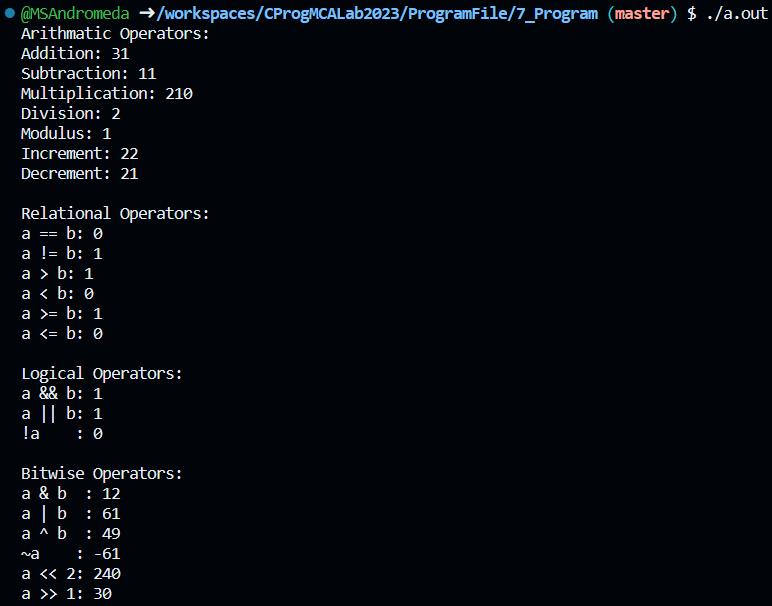
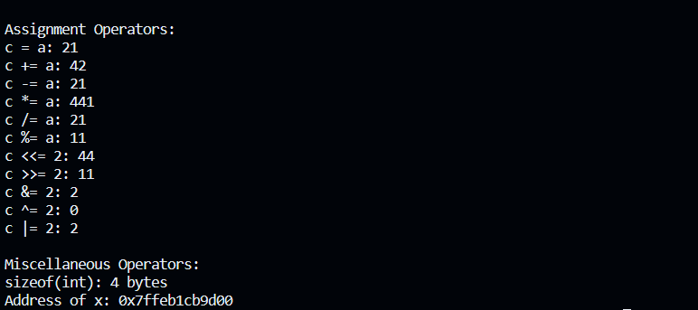

# Hello Everyone! 👋

<blockquote>
I'm Manas Anand Singh, and I'm thrilled to introduce this repository to make C Programming a breeze for everyone. If you find value in my work, please consider following me on <a href="https://github.com/MSAndromeda">github</a>. Your support means the world to me, and it keeps me motivated to continue providing helpful content.

🚀 Let's code together and learn!

**Thank you for your support!**

Warm regards,
Manas Anand Singh (Andro) 😊

<a href="https://github.com/MSAndromeda" style="background-color:#0366d6; color:#ffffff; padding: 10px 20px; text-decoration: none; border-radius: 5px; font-weight: bold;">Follow me</a>

# 💻 Program 1

## Objective

**Write a program to Print Hello World using C Language**

## Software Requirements

**`Windows 11, VS Code`**

## Theory

### #include <stdio.h>

It is a preprocessor Command which tells C Compiler to include **`stdio.h`** file before going to actual Compilation

### int main(void)

It is the main Function where the program execution begins.

### //(Single Line Comment)

It is known as Single line Comment in C Programming. It is used when we want to ignore some text we write. When we write text that can provide information about program to a programmer

### printf()

It is a pre-defined Function available in C programming for outputiing the Result to the screen.

### return 0

The next line **`return 0;`** terminates the main() function and returns the value 0

## Code

```c
// Hello World Program in C language

#include <stdio.h>

int main(void){
    printf("Hello World!\n");
    // \n -> Inserts a newline.
    return 0;
}
```

## Output


# 💻 Program 2

## Objective

**Write a program to Calculate Simple Interest of A Investment in C Language**

## Theory

### Datatypes in C


#### Primitive Datatypes
- Primitive data types are the most basic data types that are used for representing simple values such as integers, float, characters, etc.

|  Datatype                | Description                                                                                        |
| --------:                | -----------------------------------------------                                                    |
| `Integer`                | Stores whole numbers, including octal and hexadecimal.                                             |
| `Character`              | Holds a single character, requires 1 byte.                                                         |
| `Floating Point`         | Stores decimal and exponential values with single precision.                                       |
| `Double Floating Point`  | Stores decimal numbers with double precision.                                                      |
| `Void`                   | Represents absence of a value; used in various ways, including function return types and pointers. |


## Code

```c
#include<stdio.h>

int main( )
{
    int p, n ;
    float r, si ;

    p = 1000 ;
    n = 3 ;
    r = 8.5 ;

    /* formula for simple interest */
    si = p * n * r / 100 ;
    
    printf ( "Simple Interest = %f\n" , si ) ;
   /* %f for float data type in formatted strings. */

    return 0;
}
```

## Output


# 💻 Program 3

## Objective

**Write a program to provides the details of standard integer types in C Language**

## Theory

### `#include` Statements

- `#include <stdlib.h>`: This line includes the standard library for functions like memory allocation (`malloc`, `free`).

- `#include <limits.h>`: This line includes a library containing constants for integer data types' limits.

- `#include <float.h>`: This line includes a library containing constants for floating-point data types' limits.


### Integer Types
The following table provides the details of standard integer types with their storage sizes and value ranges −

|Type	|Storage size|	Value range|
|----:|------------|------------|
|`char`	|1 byte	|-128 to 127 or 0 to 255|
|`unsigned char`|	1 byte|	0 to 255|
|`signed char`|	1 byte|	-128 to 127|
|`int`	|2 or 4 bytes	|-32,768 to 32,767 or -2,147,483,648 to 2,147,483,647|
|`unsigned int`|	2 or 4 bytes	|0 to 65,535 or 0 to 4,294,967,295|
|`short`|	2 bytes	|-32,768 to 32,767|
|`unsigned short`|	2 bytes	|0 to 65,535|
|`long`	|8 bytes or (4bytes for 32 bit OS)|	-9223372036854775808 to 9223372036854775807|
|`unsigned long`	|8 bytes	|0 to 18446744073709551615|

## Code

```c
#include <stdio.h>
#include <stdlib.h>
#include <limits.h>
#include <float.h>

int main() {

    printf("CHAR_BIT    :   %d\n", CHAR_BIT);
    // %d for integer data type in formatted strings.
    printf("CHAR_MAX    :   %d\n", CHAR_MAX);
    printf("CHAR_MIN    :   %d\n", CHAR_MIN);
    printf("INT_MAX     :   %d\n", INT_MAX);
    printf("INT_MIN     :   %d\n", INT_MIN);
    printf("LONG_MAX    :   %ld\n", (long) LONG_MAX);
    // %ld for long integer data type in formatted strings.
    printf("LONG_MIN    :   %ld\n", (long) LONG_MIN);
    printf("SCHAR_MAX   :   %d\n", SCHAR_MAX);
    printf("SCHAR_MIN   :   %d\n", SCHAR_MIN);
    printf("SHRT_MAX    :   %d\n", SHRT_MAX);
    printf("SHRT_MIN    :   %d\n", SHRT_MIN);
    printf("UCHAR_MAX   :   %d\n", UCHAR_MAX);
    printf("UINT_MAX    :   %u\n", (unsigned int) UINT_MAX);
    // %u for unsigned integer data type in formatted strings.
    printf("ULONG_MAX   :   %lu\n", (unsigned long) ULONG_MAX);
    // %lu for unsigned long integer data type in formatted strings.
    printf("USHRT_MAX   :   %d\n", (unsigned short) USHRT_MAX);

    return 0;
}
```

## Output


# 💻 Program 4

## Objective

**Write a program to provides the details of standard floating-point types in C Language**

## Theory

### Floating-Point Types
The following table provide the details of standard floating-point types -
|   Type       | Storage size |       Value range         | Precision         |
| :----------- | :----------: | :-----------------------: | :----------------: |
| float        |    4 bytes   | 1.2E-38 to 3.4E+38       | 6 decimal places   |
| double       |    8 bytes   | 2.3E-308 to 1.7E+308     | 15 decimal places  |
| long double  |   10 bytes   | 3.4E-4932 to 1.1E+4932   | 19 decimal places  |


## Code

```c
#include <stdio.h>
#include <stdlib.h>
#include <limits.h>
#include <float.h>

int main() {

    printf("Storage size for float : %lu \n", sizeof(float));
    // sizeof(Data_Type): Calculates the storage space in bytes of the provided data type.

    printf("FLT_MAX: %g\n", (float) FLT_MAX);
    // %g: Format specifier for a general floating-point number.
    printf("FLT_MIN: %g\n", (float) FLT_MIN);
    printf("-FLT_MAX: %g\n", (float) -FLT_MAX);
    printf("-FLT_MIN: %g\n", (float) -FLT_MIN);
    printf("Double Max: %g\n", (double) DBL_MAX);
    printf("Double Min: %g\n", (double) DBL_MIN);
    printf("-Double Max: %g\n", (double) -DBL_MAX);

    printf("Float Precision: %d decimal places\n", FLT_DIG);
    // Decimal digits of precision for float.

    return 0;
}
```

## Output


# 💻 Program 5

## Objective

**Write a Program to demostrate the working of Variables in C Language**

## Theory

### C-Variables
A variable is nothing but a name given to a storage area that our programs can manipulate.

### Variable Definition in C
- Syntax : 
```
type variable_list;
```

- Examples:
```c
float  f, salary;
double d;
```

### Variable Declaration with Initialization
- Syntax : 
```
type variable_name = value;
```

- Examples:
```c
int d = 3, f = 5;           // definition and initializing d and f. 
char x = 'x';               // the variable x has the value 'x'.
```

## Code

```c
#include <stdio.h>

// Variable declaration:
// You will use the keyword extern to declare a variable at any place.
extern int a, b;
extern int c;
extern float f;

int main () {

   /* variable definition: */
   int a, b;
   int c;
   float f;

   /* actual initialization */
   a = 10;
   b = 20;

   c = a + b;
   printf("value of c : %d \n", c);

   f = 70.0/3.0;
   printf("value of f : %f \n", f);

   return 0;
}
```

## Output


# 💻 Program 6

## Objective
**Write a Program expalaining the working of Constants in C Language**

## Theory

### Constants
Constants refer to fixed values that the program may not alter during its execution. These fixed values are also called literals.

Constants can be of any of the basic data types like an integer constant, a floating constant, a character constant, or a string literal. There are enumeration constants as well.

#### Integer Literals
An integer literal can be a decimal, octal, or hexadecimal constant. 

Following are other examples of various types of integer literals −
```
85         /* decimal */
0213       /* octal */
0x4b       /* hexadecimal */
```

#### Floating-point Literals
A floating-point literal has an integer part, a decimal point, a fractional part, and an exponent part. You can represent floating point literals either in decimal form or exponential form.

Here are some examples of floating-point literals −

```
3.14159       /* Legal */
314159E-5L    /* Legal */
```

#### Character Constants Literals
Character literals are enclosed in single quotes, e.g., 'x' can be stored in a simple variable of char type.

A character literal can be a plain character (e.g., 'x'), an escape sequence (e.g., '\t'), or a universal character (e.g., '\u02C0').

#### Sting Literals
String literals or constants are enclosed in double quotes "". A string contains characters that are similar to character literals: plain characters, escape sequences, and universal characters.

Here is a example of string literals. The two forms are identical strings.
```
"hello, dear"

"hello, " "d" "ear"
```

### Defining Constants
There are two simple ways in C to define constants −
- Using `#define` preprocessor.
- Using `const` keyword.

#### The #define Preprocessor
Given below is the form to use #define preprocessor to define a constant −
```
#define identifier value
```

#### The const Keyword
You can use const prefix to declare constants with a specific type as follows −
```
const type variable = value;
```


## Code

```c
#include <stdio.h>

#define NEWLINE '\n'

int main() {
   const int  LENGTH = 10;
   const int  WIDTH = 5;
   int area;  
   
   area = LENGTH * WIDTH;
   printf("value of area : %d", area);
   printf("%c", NEWLINE);

   return 0;
}
```

## Output


# 💻 Program 7

## Objective

**Write a program to demostrate working of different Operators in C Language**

## Theory

### C-Operators
An operator is a symbol that tells the compiler to perform specific mathematical or logical functions. C language provides the following types of operators −
- Arithmetic Operators
- Relational Operators
- Logical Operators
- Bitwise Operators
- Assignment Operators
- Misc Operators

#### Arithmatic Operators
The following table shows all the arithmetic operators supported by the C language. Assume variable A holds 10 and variable B holds 20 then −

| Operator | Description                                                  | Example     |
| -------: | ------------------------------------------------------------ | ----------- |
|      `+` | Adds two operands.                                           | A + B = 30  |
|      `-` | Subtracts second operand from the first.                     | A − B = -10 |
|      `*` | Multiplies both operands.                                    | A * B = 200 |
|      `/` | Divides numerator by de-numerator.                           | B / A = 2   |
|      `%` | Gives remainder after an integer division.                   | B % A = 0   |
|      `++`| Increases the integer value by one.                          | A++ = 11    |
|      `--`| Decreases the integer value by one.                          | A++ = 11    |

#### Relational Operators
The following table shows all the relational operators supported by C. Assume variable A holds 10 and variable B holds 20 then −

| Operator | Description               | Example    |
| -------: | ------------------------- | ---------- |
|     `==` | Equal to                  | (A == B) is not true. |
|     `!=` | Not Equal to              | (A != B) is true. |
|      `>` | Greater than              | (A > B) is not true. |
|      `<` | Less than                 | (A < B) is true.   |
|     `>=` | Greater than equal to     | (A >= B) is not true. |
|      `<=`| Less than equal to        | (A <= B) is true. |

#### Logical Operators
The following table shows all the arithmetic operators supported by the C language. Assume variable A holds 10 and variable B holds 20 then −

| Operator | Description                                  | Example            |
| -------: | -------------------------------------------- | ------------------ |
|    `&&`  | Logical AND: True only if both non-zero     | (A && B) is false. |
|   `\|\|` | Logical OR: True if either non-zero          | (A \|\| B) is true. |
|     `!`  | Logical NOT: Reverses operand's logic state  | !(A && B) is true. |


#### Bitwise Operators
Bitwise operator works on bits and perform bit-by-bit operation. The truth tables for &, |, and ^ is as follows −
|  p  |  q  |p & q| p \| q | p ^ q  |
| :-: | :-: | :-: | :----: | :----: |
| 0   |  0  |  0  |    0   |    0   |
| 0   |  1  |  0  |    1   |    1   |
| 1   |  1  |  1  |    1   |    0   |
| 1   |  0  |  0  |    1   |    1   |

The following table lists the bitwise operators supported by C. Assume variable 'A' holds 60 and variable 'B' holds 13, then −

| Operator | Description                                      | Example         |
| -------: | ----------------------------------------------- | --------------- |
|      `&` | Binary AND: Returns 1 if both bits are 1        | (A & B) = 12    |
|     `\|` | Binary OR: Returns 1 if any bit is 1            | (A \| B) = 61   |
|      `^` | Binary XOR: Copies if set in one but not both  | (A ^ B) = 49    |
|      `~` | Unary One's Complement: Flips bits              | (~A) = -60      |
|     `<<` | Left Shift: Shifts left by right operand bits   | A << 2 = 240    |
|     `>>` | Right Shift: Shifts right by right operand bits | A >> 2 = 15     |


#### Assignment Operators

| Operator | Description                                         | Example                                  |
| -------: | --------------------------------------------------- | ---------------------------------------- |
|      `=` | Simple assignment: Assigns right to left operand    | C = A + B assigns A + B to C             |
|     `+=` | Add AND assignment: Adds right to left and assigns  | C += A is like C = C + A                 |
|     `-=` | Subtract AND assignment: Subtracts and assigns      | C -= A is like C = C - A                 |
|     `*=` | Multiply AND assignment: Multiplies and assigns     | C *= A is like C = C * A                 |
|     `/=` | Divide AND assignment: Divides and assigns          | C /= A is like C = C / A                 |
|     `%=` | Modulus AND assignment: Takes modulus and assigns   | C %= A is like C = C % A                 |
|    `<<=` | Left shift AND assignment: Left shift and assigns   | C <<= 2 is like C = C << 2               |
|    `>>=` | Right shift AND assignment: Right shift and assigns | C >>= 2 is like C = C >> 2               |
|     `&=` | Bitwise AND assignment: Bitwise AND and assigns     | C &= 2 is like C = C & 2                 |
|     `^=` | Bitwise XOR assignment: Bitwise XOR and assigns     | C ^= 2 is like C = C ^ 2                 |
|    `\|=` | Bitwise OR assignment: Bitwise OR and assigns       | C \|= 2 is like C = C \| 2               |


#### Misc Operators ↦ sizeof & ternary
Besides the operators discussed above, there are a few other important operators including sizeof and ? : supported by the C Language.

| Operator   | Description                                   | Example                                               |
| ---------: | --------------------------------------------- | ----------------------------------------------------- |
| `sizeof()` | Returns size of variable                      | `sizeof(a)` for `a` as integer returns 4              |
|      `&`   | Returns address of variable                   | `&a` returns the actual address of the variable       |
|      `*`   | Pointer to variable                           | `*a` returns the value at the address stored in `a`   |
|      `?:`  | Conditional (Ternary) Operator                | `Condition ? X : Y` returns `X` if true, `Y` otherwise|

## Code

```c
#include <stdio.h>

int main() {

    unsigned int a = 21;
    unsigned int b = 10;
    int c;
   
    printf("Arithmatic Operators:\n");
    printf("a + b: %d\n", a + b );	
    printf("a - b: %d\n", a - b );
    printf("a * b: %d\n", a * b );
    printf("a / b: %d\n", a / b );
    printf("a % b: %d\n", a % b );
    printf("++a: %d\n", ++a );
    printf("--a: %d\n", --a );


    printf("\nRelational Operators:\n");
    printf("a == b: %d\n", a == b); // 0 (false)
    printf("a != b: %d\n", a != b); // 1 (true)
    printf("a > b: %d\n", a > b);   // 0 (false)
    printf("a < b: %d\n", a < b);   // 1 (true)
    printf("a >= b: %d\n", a >= b); // 0 (false)
    printf("a <= b: %d\n", a <= b); // 1 (true)
   

    printf("\nLogical Operators:\n");
    printf("a && b: %d\n", a && b);
    printf("a || b: %d\n", a || b);
    printf("!a    : %d\n", !a);


    a = 60;
    b = 13;

    printf("\nBitwise Operators:\n");
    printf("a & b  : %d\n", a & b);
    printf("a | b  : %d\n", a | b);
    printf("a ^ b  : %d\n", a ^ b);
    printf("~a    : %d\n", ~a);
    printf("a << 2: %d\n", a << 2);
    printf("a >> 1: %d\n", a >> 1);


    a = 21;

    printf("\nAssignment Operators:\n");
    c = a;
    printf("c = a: %d\n", c);
    c += a;
    printf("c += a: %d\n", c);
    c -= a;
    printf("c -= a: %d\n", c);
    c *= a;
    printf("c *= a: %d\n", c);
    c /= a;
    printf("c /= a: %d\n", c);
    c = 200;
    c %= a;
    printf("c %%= a: %d\n", c);
    c <<=  2;
    printf("c <<= 2: %d\n", c );
    c >>=  2;
    printf("c >>= 2: %d\n", c );
    c &=  2;
    printf("c &= 2: %d\n", c );
    c ^=  2;
    printf("c ^= 2: %d\n", c );
    c |=  2;
    printf("c |= 2: %d\n", c );


    printf("\nMiscellaneous Operators:\n");
    printf("sizeof(int): %lu bytes\n", sizeof(int)); // Sizeof operator
    int x = 42;
    int *ptr = &x; // Address-of operator
    printf("Address of x: %p\n", ptr);

    return 0;
}
```

## Output





# 💻 Program 8

## Objective

**Write a program to demostrate working of if statement in C Programming**

## Theory

### C - Decision Making


Decision-making structures in programming involve evaluating conditions and executing specific statements based on whether the condition is true or false.

Show below is the general form of a typical decision making structure found in most of the programming languages −


Following are the decision-making statements available in C:

- if Statement
- if-else Statement
- Nested if Statement
- if-else-if Ladder
- switch Statement
- Conditional Operator
- Jump Statements: 
   - break
   - continue
   - goto
   - return

### if Statement:

An if statement consists of a boolean expression followed by one or more statements.


#### if Statement Syntax

```
if(boolean_expression) {
   /* statement(s) will execute if the boolean expression is true */
}
```

## Code

```c
// TutorialsPoint Program
#include <stdio.h>

int main () {
   int a = 10;

   /* check the boolean condition using if statement */

   if( a < 20 ) {
      /* if condition is true then print the following */
      printf("a is less than 20\n" );
   }

   printf("value of a is : %d\n", a);

   return 0;
}

// C Programming Book Program
#include <stdio.h>

int main(){
    int num;
    printf("Enter a number less than 10: ");
    scanf("%d", &num);

    if(num <= 10)
        printf("What an obedient servant you are!\n");

    return 0;
}

```

## Output


# 💻 Program 9

## Objective

**Write a program to demostrate working of if-else statement in C Programming**

## Theory

### if-else Statement:

An if statement can be followed by an optional else statement, which executes when the Boolean expression is false.

### if-else Statement Syntax

```
if(boolean_expression) {
   /* statement(s) will execute if the boolean expression is true */
} else {
   /* statement(s) will execute if the boolean expression is false */
}
```

## Code

```c
// TutorialsPoint Program
#include <stdio.h>

int main () {

   /* local variable definition */
   int a = 100;

   /* check the boolean condition */
   if( a < 20 ) {
      /* if condition is true then print the following */
      printf("a is less than 20\n" );
   } else {
      /* if condition is false then print the following */
      printf("a is not less than 20\n" );
   }

   printf("value of a is : %d\n", a);

   return 0;
}

// C Programming Book Program

/* Calculation of gross salary */
#include <stdio.h>
int main()
{
    float bs, gs, da, hra ;
    printf ( "Enter basic salary " ) ;
    scanf ( "%f", &bs ) ;

    if ( bs < 1500 )
    {
        hra = bs * 10 / 100 ;
        da = bs * 90 / 100 ;
    }
    else
    {
        hra = 500 ;
        da = bs * 98 / 100 ;
    }
    gs = bs + hra + da ;
    printf ( "gross salary = Rs. %f", gs ) ;
}

```

## Output


# 💻 Program 10

## Objective
**Write a program to demostrate working of nested if statement in C Programming**


## Theory

### nested if Statement:
You can use one if or else if statement inside another if or else if statement(s).

### nested if Statement Syntax
```
if( boolean_expression 1) {

   /* Executes when the boolean expression 1 is true */
   if(boolean_expression 2) {
      /* Executes when the boolean expression 2 is true */
   }
}
```

## Code

```c
// TutorialsPoint Program
#include <stdio.h>
 
int main () {

   /* local variable definition */
   int a = 100;
   int b = 200;
 
   /* check the boolean condition */
   if( a == 100 ) {
   
      /* if condition is true then check the following */
      if( b == 200 ) {
         /* if condition is true then print the following */
         printf("Value of a is 100 and b is 200\n" );
      }
   }
   
   printf("Exact value of a is : %d\n", a );
   printf("Exact value of b is : %d\n", b );
 
   return 0;
}
// C Programming Book Program

/* A quick demo of nested if-else */ 
#include <stdio.h>
int main( ) 
{ 
    int i ; 
    printf ( "Enter either 1 or 2 " ) ; 
    scanf ( "%d", &i ) ; 
    if ( i == 1 ) 
        printf ( "You would go to heaven !" ) ; 
    else 
    { 
        if ( i == 2 ) 
            printf ( "Hell was created with you in mind" ) ; 
        else 
            printf ( "How about mother earth !" ) ; 
    } 
    return 0;
} 


```

## Output


# 💻 Program 11
## Objective
**Write a program to demostrate working of while Loop in C Programming**


## Theory

### C - Loops


A loop statement allows us to execute a statement or group of statements multiple times. Given below is the general form of a loop statement in most of the programming languages −


### While Loop:
Repeats a statement or group of statements while a given condition is true. It tests the condition before executing the loop body.

### While Loop Syntax
```
while(condition) {
   statement(s);
}
```

## Code
```c
// TutorialsPoint Program
#include <stdio.h>
 
int main () {

   /* local variable definition */
   int a = 10;

   /* while loop execution */
   while( a < 20 ) {
      printf("value of a: %d\n", a);
      a++;
   }
 
   return 0;
}

// C Programming Book Program
#include<stdio.h>
int main( ) 
{ 
    int p, n, count ; 
    float r, si ; 
    count = 1 ; 
    while ( count <= 3 ) 
    { 
        printf ( "\nEnter values of p, n and r : " ) ;
        scanf("%d %d %f", &p, &n, &r);
        si=p*n*r/100;
        printf ( "Simple interest = Rs. %f\n", si ) ; 
        count++;
    } 
    return 0;
}
```

## Output


# 💻 Program 12
## Objective
**Write a program to demostrate working of do...while Loop in C Programming**

## Theory

### do...while Loop:
It is more like a while statement, except that it tests the condition at the end of the loop body.

### do..while Loop Syntax
```
do {
   statement(s);
} while( condition );
```

## Code
```c
// TutorialsPoint Program
#include <stdio.h>
 
int main () {

   /* local variable definition */
   int a = 10;

   /* do loop execution */
   do {
      printf("value of a: %d\n", a);
      a++;
   }while( a < 20 );
 
   return 0;
}

// C Programming Book Program
#include<stdio.h>

int main() 
{ 
    do 
    { 
        printf ( "Hello there \n") ; 
    } while ( 4 < 1 ) ; 
    
    return 0;
}
```

## Output


# 💻 Program 13
## Objective
**Write a matrix program to demostrate working of for Loop in C Programming**

## Theory

### for Loop:
Executes a sequence of statements multiple times and abbreviates the code that manages the loop variable.

### for Loop Syntax
```
for ( init; condition; increment ) {
   statement(s);
}
```

## Code
```c
// For Loop Matrix Program
#include <stdio.h>

int main() {
    int rows, cols;

    // Input the dimensions of the matrices
    printf("Enter the number of rows: ");
    scanf("%d", &rows);
    printf("Enter the number of columns: ");
    scanf("%d", &cols);

    // Initialize matrices A and B
    int A[rows][cols];
    int B[rows][cols];

    // Input elements for matrix A
    printf("Enter elements for matrix A:\n");
    for (int i = 0; i < rows; i++) {
        for (int j = 0; j < cols; j++) {
            printf("A[%d][%d]: ", i, j);
            scanf("%d", &A[i][j]);
        }
    }

    // Input elements for matrix B
    printf("Enter elements for matrix B:\n");
    for (int i = 0; i < rows; i++) {
        for (int j = 0; j < cols; j++) {
            printf("B[%d][%d]: ", i, j);
            scanf("%d", &B[i][j]);
        }
    }

    // Addition of matrices A and B
    int sum[rows][cols];
    for (int i = 0; i < rows; i++) {
        for (int j = 0; j < cols; j++) {
            sum[i][j] = A[i][j] + B[i][j];
        }
    }

    // Subtraction of matrices A and B
    int difference[rows][cols];
    for (int i = 0; i < rows; i++) {
        for (int j = 0; j < cols; j++) {
            difference[i][j] = A[i][j] - B[i][j];
        }
    }

    // Multiplication of matrices A and B
    int product[rows][cols];
    if (cols == rows) {
        for (int i = 0; i < rows; i++) {
            for (int j = 0; j < cols; j++) {
                product[i][j] = 0;
                for (int k = 0; k < cols; k++) {
                    product[i][j] += A[i][k] * B[k][j];
                }
            }
        }
    } else {
        printf("Matrix multiplication is not possible because the number of columns in A is not equal to the number of rows in B.\n");
    }

    // Display results
    printf("\nMatrix A:\n");
    for (int i = 0; i < rows; i++) {
        for (int j = 0; j < cols; j++) {
            printf("%d\t", A[i][j]);
            // \t -> Inserts a tab in the text at this point.
        }
        printf("\n");
    }

    printf("\nMatrix B:\n");
    for (int i = 0; i < rows; i++) {
        for (int j = 0; j < cols; j++) {
            printf("%d\t", B[i][j]);
        }
        printf("\n");
    }

    printf("\nMatrix A + B:\n");
    for (int i = 0; i < rows; i++) {
        for (int j = 0; j < cols; j++) {
            printf("%d\t", sum[i][j]);
        }
        printf("\n");
    }

    printf("\nMatrix A - B:\n");
    for (int i = 0; i < rows; i++) {
        for (int j = 0; j < cols; j++) {
            printf("%d\t", difference[i][j]);
        }
        printf("\n");
    }

    if (cols == rows) {
        printf("\nMatrix A * B:\n");
        for (int i = 0; i < rows; i++) {
            for (int j = 0; j < cols; j++) {
                printf("%d\t", product[i][j]);
            }
            printf("\n");
        }
    }else{
        printf("The Multiplication of Given matrices is not possible");
    }

    return 0;
}

```

## Output


# 💻 Program 14
## Objective
**Write a program to print different patterns using for Loop in C Programming**

## Code
```c
#include <stdio.h>

int main() {
    int n = 5;

    printf("Right Triangle Pattern:\n");
    for (int i = 0; i < n; i++) {
        for (int j = 0; j <= i; j++) {
            printf("* ");
        }
        printf("\n");
    }

    printf("\nLeft Triangle Pattern:\n");
	for (int i = 0; i < n; i++) {
		for (int j = 0; j < 2 * (n - i) - 1; j++) {
			printf(" ");
		}
		for (int k = 0; k <= i; k++) {
			printf("* ");
		}
		printf("\n");
	}

    printf("\nInverted Right Triangle Pattern:\n");
        for (int i = n; i > 0; i--) {
        for (int j = 0; j < i; j++) {
            printf("* ");
        }
        printf("\n");
    }

    printf("\nPyramid Pattern:\n");
        for (int i = 1; i <= n; i++) {
        for (int j = 1; j <= n - i; j++) {
            printf(" ");
        }
        for (int k = 1; k <= 2 * i - 1; k++) {
            printf("*");
        }
        printf("\n");
    }

    printf("\nDiamond Pattern:\n");
        for (int i = 0; i < n; i++) {
        for (int j = 0; j < n - i; j++) {
            printf("  ");
        }
        for (int k = 0; k < 2 * i + 1; k++) {
            printf("* ");
        }
        printf("\n");
    }
    for (int i = n - 2; i >= 0; i--) {
        for (int j = 0; j < n - i; j++) {
            printf("  ");
        }
        for (int k = 0; k < 2 * i + 1; k++) {
            printf("* ");
        }
        printf("\n");
    }

    return 0;
}
```

## Output


# 💻 Program 15
## Objective
**Write a program to demostrate Working of Switch case in C Programming**

## Theory

### Switch Statement
A switch statement allows a variable to be tested for equality against a list of values.

#### Syntax
```
switch(expression) {

   case constant-expression  :
      statement(s);
      break; /* optional */
	
   case constant-expression  :
      statement(s);
      break; /* optional */
  
   /* you can have any number of case statements */
   default : /* Optional */
   statement(s);
}
```

### break statement
Terminates the loop or switch statement and transfers execution to the statement immediately following the loop or switch.

#### Syntax
```
break;
```

### continue statement
Causes the loop to skip the remainder of its body and immediately retest its condition prior to reiterating.

#### Syntax
```
continue;
```

## Code
```c
// Program from Let us C
#include <stdio.h>

int main( ) 
{ 
    int i = 2 ; 
    switch ( i ) 
    { 
        case 1 : 
            printf ( "I am in case 1 \n" ) ; 
            break ; 
        case 2 : 
            printf ( "I am in case 2 \n" ) ; 
            break ; 
        case 3 : 
            printf ( "I am in case 3 \n" ) ; 
            break ; 
        default : 
            printf ( "I am in default \n" ) ; 
    }
    return 0;
}

// Program from Tutorials Point
#include <stdio.h>
 
int main () {

   /* local variable definition */
   char grade = 'B';

   switch(grade) {
      case 'A' :
         printf("Excellent!\n" );
         break;
      case 'B' :
      case 'C' :
         printf("Well done\n" );
         break;
      case 'D' :
         printf("You passed\n" );
         break;
      case 'F' :
         printf("Better try again\n" );
         break;
      default :
         printf("Invalid grade\n" );
   }
   
   printf("Your grade is %c\n", grade );
 
   return 0;
}
```

## Output

